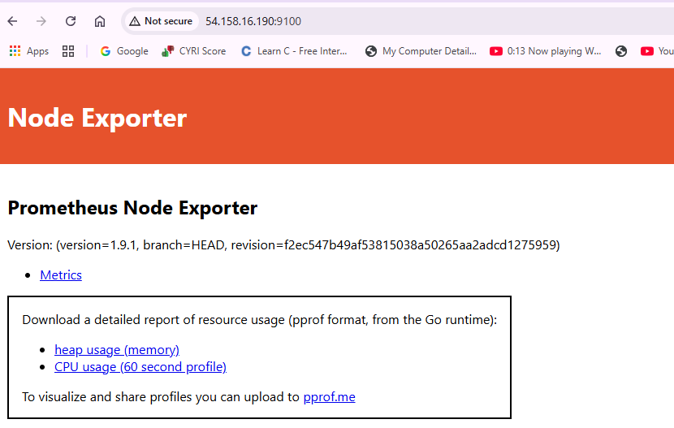
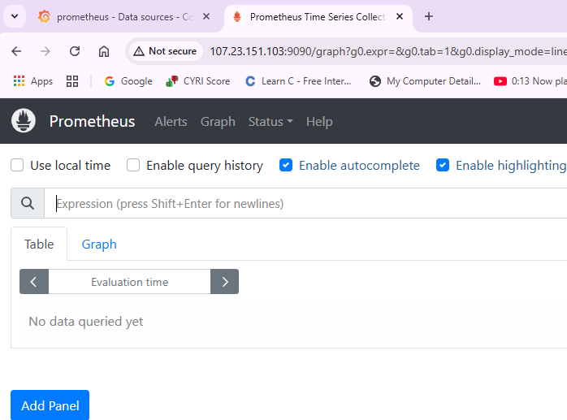
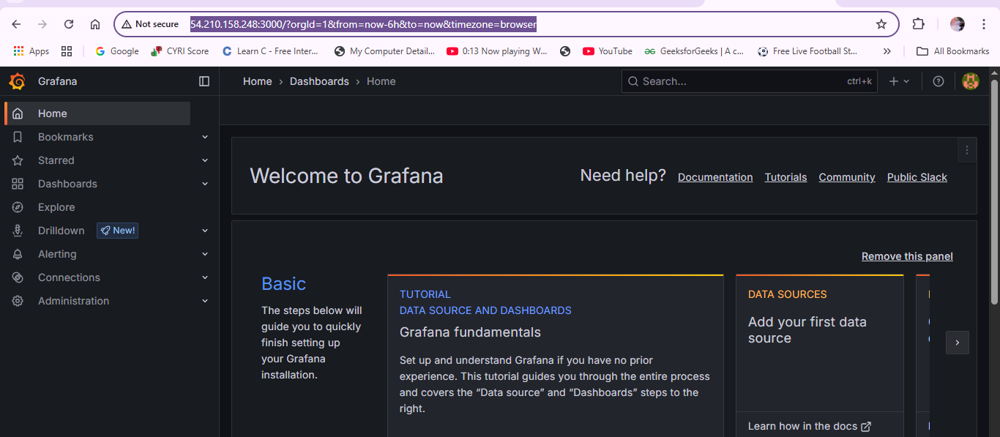

  

http://54.210.158.248:3000/?orgId=1&from=now-6h&to=now&timezone=browser

🛠️ How Grafana Connects to Prometheus (Step-by-Step)
✅ Step 1: Prometheus is Already Running
You have Prometheus running on:

h
Copy
Edit
http://<prometheus-ec2-ip>:9090
It exposes a RESTful API and /metrics-style endpoints for data queries.

This is a passive service — it just waits for someone (like Grafana) to query it.

✅ Step 2: You Configure Grafana to Use Prometheus
Inside Grafana UI:

⚙️ Configuration → Data Sources → Add data source → Prometheus

You fill in:

cpp
Copy
Edit
URL: http://<prometheus-private-ip>:9090
Then click:

csharp
Copy
Edit
[Save & Test]
🔁 What Happens Under the Hood
Grafana:

Sends a GET request like:

bash
Copy
Edit
GET /api/v1/label/__name__/values
Prometheus replies with available metric names (like node_cpu_seconds_total, etc.)

Grafana confirms connectivity and stores this config

🔌 Summary of Connection Flow
scss
Copy
Edit
GRAFANA ------------------> PROMETHEUS
        (HTTP API Query)        (Serves metrics data)
Prometheus:

🧱 Alerting Architecture Overview
less
Copy
Edit
[Node Exporter] ---> [Prometheus] ---> [Alertmanager] ---> [Email, Slack, etc.]
                              |
                           Alert Rules
Prometheus: Detects alert conditions based on metric thresholds

Alertmanager: Handles notifications, grouping, silencing, retries

🧩 Alertmanager Workflow (with Deep Explanation)
🔹 Step 1: Understand the Roles
✅ What is Alertmanager?
Alertmanager is a standalone service that:

Receives alerts from Prometheus

Groups, deduplicates, and routes alerts

Sends notifications to external systems (email, Slack, PagerDuty, etc.)

🧠 Why is it needed?
Prometheus can detect problems, but it cannot notify users. Alertmanager fills this gap — it's responsible for alert delivery logic.

🔹 Step 2: Deploy Alertmanager (on same Prometheus host)
✅ What are we doing?
We’ll run Alertmanager in a Docker container and expose it on port 9093.

🛠️ How:
bash
Copy
Edit
docker run -d \
  -p 9093:9093 \
  --name alertmanager \
  -v ~/alertmanager:/etc/alertmanager \
  prom/alertmanager
You’ll need a config file at ~/alertmanager/alertmanager.yml

Example alertmanager.yml (basic email setup):
yaml
Copy
Edit
global:
  smtp_smarthost: 'smtp.gmail.com:587'
  smtp_from: 'your-email@gmail.com'
  smtp_auth_username: 'your-email@gmail.com'
  smtp_auth_password: 'your-email-password'

route:
  receiver: 'email-team'

receivers:
  - name: 'email-team'
    email_configs:
      - to: 'destination-email@gmail.com'
🔐 Use app passwords or test with mailhog for local test envs.

🔹 Step 3: Connect Prometheus to Alertmanager
✅ What are we doing?
Update prometheus.yml to add alerting config:

yaml
Copy
Edit
alerting:
  alertmanagers:
    - static_configs:
        - targets: ['localhost:9093']
🧠 Why?
So Prometheus knows where to forward alert triggers.

🔁 You must reload Prometheus after this change.

🔹 Step 4: Define Alert Rules in Prometheus
✅ What are we doing?
We’re telling Prometheus what to watch for and when to raise an alert.

Create a new file: alert.rules.yml

yaml
Copy
Edit
groups:
- name: node-alerts
  rules:
  - alert: HighCPUUsage
    expr: avg(rate(node_cpu_seconds_total{mode="user"}[1m])) > 0.7
    for: 1m
    labels:
      severity: warning
    annotations:
      summary: "High CPU detected"
      description: "CPU usage above 70% for 1 minute"
✅ Then reference this file in prometheus.yml:
yaml
Copy
Edit
rule_files:
  - "alert.rules.yml"
🧠 What’s happening:

Prometheus evaluates rules continuously

If the condition expr is true for more than for: 1m, an alert is fired

This is sent to Alertmanager

🔹 Step 5: Access Alertmanager UI
txt
Copy
Edit
http://<your-ec2-ip>:9093
Here you can:

See active alerts

Silence noisy alerts

Check alert delivery logs

✅ Summary: End-to-End Flow
App exposes metrics

Prometheus scrapes metrics

Prometheus evaluates alert rules

On match, Prometheus sends alert to Alertmanager

Alertmanager sends a notification (email/Slack/etc.)

🧪 Test the Alert Flow
Manually trigger condition
(e.g., simulate high CPU load using stress command)

Check Prometheus UI

http://<ip>:9090/alerts

Alert should be firing

Check Alertmanager UI

http://<ip>:9093

Confirm alert was received

Check Notification

Email or Slack message should arrive

🚀 Full Lifecycle — With Deep Explanation
🔹 Step 1: Provision 3 EC2 Instances
✅ What are we doing?
We are creating 3 EC2 instances in AWS:

App Instance — where a containerized app emits metrics.

Prometheus Instance — where Prometheus will scrape and store metrics.

Grafana Instance — where Grafana will read metrics and visualize them.

🧠 Why are we doing this?
Separation of Concerns: Each instance is assigned a single responsibility. This reflects production-like behavior — app servers, monitoring servers, and dashboards usually run independently.

Network Simulation: Prometheus and Grafana accessing a remote app simulates real-world observability.

Security & Access Control: We may later need to apply IAM roles, Security Groups, NATs, etc.

🛠️ How do we do this?
Use AWS Console or CLI to create 3 Ubuntu EC2 instances.

Allocate security group rules:

App: open 9100 (Node Exporter), or 8080 (custom app)

Prometheus: open 9090

Grafana: open 3000

Enable SSH (port 22) access for all

🎯 What does this enable next?
Now we have base compute nodes to host our app, metrics collector, and dashboard UI — all in isolated roles.

🔹 Step 2: Install Docker on All 3 Instances
✅ What are we doing?
Installing Docker so we can run Prometheus, Grafana, and the app as containers.

🧠 Why are we doing this?
Containerization = Portability: Docker makes it easy to deploy and destroy services.

No System Pollution: Prometheus and Grafana are self-contained within their containers. No messy installs.

Faster Bootstrapping: Running a container is much faster than manual setup.

🛠️ How do we do this?
Run the following on each EC2 instance:

bash
Copy
Edit
sudo apt update
sudo apt install docker.io -y
sudo systemctl start docker
sudo systemctl enable docker
🎯 What does this enable next?
We are now ready to deploy containerized applications (Prometheus, Grafana, or custom apps) with just one command (docker run).

🔹 Step 3: Deploy a Metrics-Exposing App (Node Exporter)
✅ What are we doing?
On the app-instance, we’ll deploy a container that exposes metrics in Prometheus-compatible format.

🧠 Why are we doing this?
Prometheus needs a target to collect data from — a web endpoint that emits system or application metrics.
Node Exporter is a default choice:

Emits CPU, memory, disk, and OS stats

Runs with one command

Accessible via /metrics endpoint

🛠️ How do we do this?
bash
Copy
Edit
docker run -d \
  -p 9100:9100 \
  --name node-exporter \
  prom/node-exporter
You can verify with:

bash
Copy
Edit
curl http://localhost:9100/metrics
🎯 What does this enable next?
We now have a metrics source that Prometheus can target. The app is containerized and running.

🔹 Step 4: Deploy Prometheus
✅ What are we doing?
On the prometheus-instance, we’ll run Prometheus and configure it to scrape the metrics from the app.

🧠 Why are we doing this?
Prometheus is the metrics aggregator. Its responsibilities are:

Discover and scrape targets (like our app)

Store the collected metrics

Provide a query engine (PromQL)

Serve metrics to Grafana

We need to tell it:

How often to scrape

What target(s) to scrape

🛠️ How do we do this?
Create config directory:

bash
Copy
Edit
mkdir ~/prometheus
cd ~/prometheus
Create config file:

bash
Copy
Edit
nano prometheus.yml
Add:

yaml
Copy
Edit
global:
  scrape_interval: 15s

scrape_configs:
  - job_name: 'node-exporter'
    static_configs:
      - targets: ['<app-instance-private-ip>:9100']
Run Prometheus container:

bash
Copy
Edit
docker run -d \
  -p 9090:9090 \
  --name prometheus \
  -v ~/prometheus/prometheus.yml:/etc/prometheus/prometheus.yml \
  prom/prometheus
🎯 What does this enable next?
Prometheus now scrapes the app's metrics every 15 seconds and stores them. It also exposes a web UI at http://<prometheus-ip>:9090.

🔹 Step 5: Deploy Grafana
✅ What are we doing?
On the grafana-instance, we deploy Grafana as a container.

🧠 Why are we doing this?
Grafana is the visualization layer. Prometheus only stores metrics — Grafana allows:

Building time-series graphs

Alerting

Importing community dashboards

We need Grafana to query Prometheus and render those metrics.

🛠️ How do we do this?
bash
Copy
Edit
docker run -d \
  -p 3000:3000 \
  --name grafana \
  grafana/grafana
Access:
http://<grafana-public-ip>:3000
Default credentials: admin / admin

🎯 What does this enable next?
We can now log into Grafana, configure Prometheus as a data source, and start building dashboards.

🔹 Step 6: Connect Grafana to Prometheus
✅ What are we doing?
In Grafana UI, we’ll register Prometheus as a data source.

🧠 Why are we doing this?
Grafana doesn’t collect data — it queries from backends like Prometheus.
To render dashboards, Grafana must know where Prometheus is, and how to query it.

🛠️ How do we do this?
Grafana UI → ⚙️ → Data Sources

Add Data Source → Select Prometheus

Set URL: http://<prometheus-private-ip>:9090

Click Save & Test

🎯 What does this enable next?
Grafana can now query metrics from Prometheus using PromQL, enabling dashboards.

🔹 Step 7: Create or Import a Dashboard
✅ What are we doing?
Use a prebuilt dashboard to visualize system metrics (e.g., CPU, RAM, etc.).

🧠 Why are we doing this?
You don’t need to build panels from scratch. Grafana has a library of community dashboards for common exporters (like Node Exporter).

🛠️ How do we do this?
Go to Dashboards → Import

Paste ID: 1860 → Node Exporter Full

Select your Prometheus data source

Click Import

🎯 What does this achieve?
Your dashboard will now visualize live metrics — CPU, Memory, Disk, Network — in real-time, pulled from Prometheus, which is scraping your app.

✅ Final Result
You now have a complete observability pipeline:

App emits metrics ➜

Prometheus scrapes them ➜

Grafana visualizes them

Everything is containerized, modular, and production-aligned.

